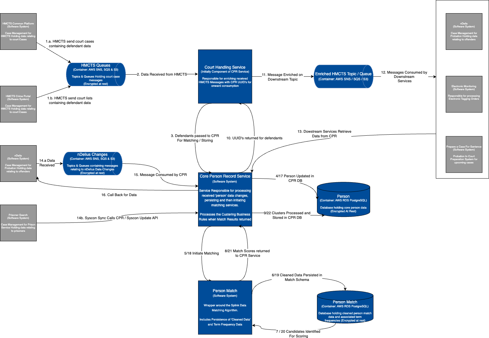

# HMPPS Person Record

## Table of Contents
1. [Introduction](#Introduction)
   1. [Dependant Services](#Dependant-Services)
2. [Application Data Flow](#Application-Data-Flow)

## Introduction

A service for managing identity data about the people we look after in HMPPS.

This Kotlin application integrates with a PostgreSQL database to manage and store person-related information.
It consumes messages from AWS SQS queues and republishes them to a designated topic. Additionally, it exposes a RESTful API for accessing and managing person records, built using Spring Boot.

### Dependant Services

* [hmpps-person-match](https://github.com/ministryofjustice/hmpps-person-match): This is a Python application built with FastAPI that accepts and stores person information for the purpose of matching and scoring records against one another.
    It integrates with a PostgreSQL database to manage and retrieve relevant data.

## Application Data Flow

This diagram shows the flow of data through the application from its source systems to the consumers. Inclusive of the data flow to its dependant services and integration with external systems:

## Monitoring

See environment specific monitoring links:

### Development (Dev)

* **Application**:
  * [Memory and CPU for hmpps-person-record](https://grafana.live.cloud-platform.service.justice.gov.uk/d/a164a7f0339f99e89cea5cb47e9be617/kubernetes-compute-resources-workload?orgId=1&refresh=10s&from=now-1h&to=now&var-datasource=default&var-cluster=&var-namespace=hmpps-person-record-dev&var-workload=hmpps-person-record&var-type=deployment)
  * [Memory and CPU for hmpps-person-record RDS](https://grafana.live.cloud-platform.service.justice.gov.uk/d/VR46pmwWk/aws-rds?orgId=1&var-datasource=P896B4444D3F0DAB8&var-region=default&var-dbinstanceidentifier=cloud-platform-21758fcf16e3a488&from=now-6h&to=now)
  * [Memory and CPU for hmpps-person-match](https://grafana.live.cloud-platform.service.justice.gov.uk/d/a164a7f0339f99e89cea5cb47e9be617/kubernetes-compute-resources-workload?orgId=1&refresh=10s&from=now-1h&to=now&var-datasource=prometheus&var-cluster=&var-namespace=hmpps-person-record-dev&var-workload=hmpps-person-match&var-type=deployment&timezone=utc)
  * [Memory and CPU for hmpps-person-match RDS](https://grafana.live.cloud-platform.service.justice.gov.uk/d/VR46pmwWk/aws-rds?orgId=1&var-datasource=P896B4444D3F0DAB8&var-region=default&var-dbinstanceidentifier=cloud-platform-630cc18efc9725ba&from=now-3h&to=now&timezone=browser)
* **AWS**:
  * **Queues**:
    * **Courts**:
      * [CPR Court Case Events](https://grafana.live.cloud-platform.service.justice.gov.uk/d/AWSSQS000/aws-sqs?orgId=1&var-datasource=P896B4444D3F0DAB8&var-region=default&var-queue=hmpps-person-record-development-cpr_court_cases_queue.fifo&from=now-24h&to=now&timezone=browser)
      * [CPR Court Case Events DLQ](https://grafana.live.cloud-platform.service.justice.gov.uk/d/AWSSQS000/aws-sqs?orgId=1&var-datasource=P896B4444D3F0DAB8&var-region=default&var-queue=hmpps-person-record-development-cpr_court_cases_dlq.fifo&from=now-24h&to=now&timezone=browser)
    * **Delius**:
      * [Delius Offender Events](https://grafana.live.cloud-platform.service.justice.gov.uk/d/AWSSQS000/aws-sqs?orgId=1&var-datasource=Cloudwatch&var-region=default&var-queue=hmpps-person-record-development-cpr_delius_offender_events_queue)
      * [Delius Offender Events DLQ](https://grafana.live.cloud-platform.service.justice.gov.uk/d/AWSSQS000/aws-sqs?orgId=1&var-datasource=Cloudwatch&var-region=default&var-queue=hmpps-person-record-development-cpr_delius_offender_events_dlq)
      * [Delius Merge Events](https://grafana.live.cloud-platform.service.justice.gov.uk/d/AWSSQS000/aws-sqs?orgId=1&var-datasource=P896B4444D3F0DAB8&var-region=default&var-queue=hmpps-person-record-development-cpr_delius_merge_events_queue&from=now-24h&to=now)
      * [Delius Merge Events DLQ](https://grafana.live.cloud-platform.service.justice.gov.uk/d/AWSSQS000/aws-sqs?orgId=1&var-datasource=P896B4444D3F0DAB8&var-region=default&var-queue=hmpps-person-record-development-cpr_delius_merge_events_dlq&from=now-24h&to=now)
      * [Delius Delete Events](https://grafana.live.cloud-platform.service.justice.gov.uk/d/AWSSQS000/aws-sqs?orgId=1&var-datasource=P896B4444D3F0DAB8&var-region=default&var-queue=hmpps-person-record-development-cpr_delius_delete_events_queue&from=now-24h&to=now)
      * [Delius Delete Events DLQ](https://grafana.live.cloud-platform.service.justice.gov.uk/d/AWSSQS000/aws-sqs?orgId=1&var-datasource=P896B4444D3F0DAB8&var-region=default&var-queue=hmpps-person-record-development-cpr_delius_delete_events_dlq&from=now-24h&to=now)
    * **Nomis**:
      * [Nomis Events](https://grafana.live.cloud-platform.service.justice.gov.uk/d/AWSSQS000/aws-sqs?orgId=1&var-datasource=P896B4444D3F0DAB8&var-region=default&var-queue=hmpps-person-record-development-cpr_nomis_events_queue&from=now-24h&to=now)
      * [Nomis Events DLQ](https://grafana.live.cloud-platform.service.justice.gov.uk/d/AWSSQS000/aws-sqs?orgId=1&var-datasource=P896B4444D3F0DAB8&var-region=default&var-queue=hmpps-person-record-development-cpr_nomis_events_dlq&from=now-24h&to=now)
      * [Nomis Merge Events](https://grafana.live.cloud-platform.service.justice.gov.uk/d/AWSSQS000/aws-sqs?orgId=1&var-datasource=P896B4444D3F0DAB8&var-region=default&var-queue=hmpps-person-record-development-cpr_nomis_merge_events_queue&from=1723710226408&to=1723796626408)
      * [Nomis Merge Events DLQ](https://grafana.live.cloud-platform.service.justice.gov.uk/d/AWSSQS000/aws-sqs?orgId=1&var-datasource=P896B4444D3F0DAB8&var-region=default&var-queue=hmpps-person-record-development-cpr_nomis_merge_events_dlq&from=1723710286631&to=1723796686632)
  * **Topics**:
    * [CPR Court Case Topic](https://grafana.live.cloud-platform.service.justice.gov.uk/d/AWSSNS001/aws-sns?from=now-12h&to=now&timezone=browser&var-datasource=P896B4444D3F0DAB8&var-region=default&var-topic=cloud-platform-hmpps-person-record-6db24f48dcd80b9e5d946f554d5e931f)

### Preproduction (Preprod)

* **Application**:
    * [Memory and CPU for hmpps-person-record](https://grafana.live.cloud-platform.service.justice.gov.uk/d/a164a7f0339f99e89cea5cb47e9be617/kubernetes-compute-resources-workload?orgId=1&refresh=10s&from=now-1h&to=now&var-datasource=default&var-cluster=&var-namespace=hmpps-person-record-preprod&var-workload=hmpps-person-record&var-type=deployment)
    * [Memory and CPU for hmpps-person-record RDS](https://grafana.live.cloud-platform.service.justice.gov.uk/d/VR46pmwWk/aws-rds?orgId=1&var-datasource=Cloudwatch&var-region=default&var-dbinstanceidentifier=cloud-platform-288cab966b34da54&from=now-6h&to=now)
    * [Memory and CPU for hmpps-person-match](https://grafana.live.cloud-platform.service.justice.gov.uk/d/a164a7f0339f99e89cea5cb47e9be617/kubernetes-compute-resources-workload?orgId=1&refresh=10s&from=now-6h&to=now&var-datasource=prometheus&var-cluster=&var-namespace=hmpps-person-record-preprod&var-workload=hmpps-person-match&var-type=deployment&timezone=utc)
    * [Memory and CPU for hmpps-person-match RDS](https://grafana.live.cloud-platform.service.justice.gov.uk/d/VR46pmwWk/aws-rds?orgId=1&var-datasource=P896B4444D3F0DAB8&var-region=default&var-dbinstanceidentifier=cloud-platform-05509d3640870a0b&from=now-6h&to=now&timezone=browser)
* **AWS**:
    * **Queues**:
        * **Courts**:
            * [CPR Court Case Events](https://grafana.live.cloud-platform.service.justice.gov.uk/d/AWSSQS000/aws-sqs?orgId=1&var-datasource=P896B4444D3F0DAB8&var-region=default&var-queue=hmpps-person-record-preprod-cpr_court_cases_queue.fifo&from=now-24h&to=now&timezone=browser)
            * [CPR Court Case Events DLQ](https://grafana.live.cloud-platform.service.justice.gov.uk/d/AWSSQS000/aws-sqs?orgId=1&var-datasource=P896B4444D3F0DAB8&var-region=default&var-queue=hmpps-person-record-preprod-cpr_court_cases_dlq.fifo&from=now-24h&to=now&timezone=browser)
        * **Delius**:
            * [Delius Offender Events](https://grafana.live.cloud-platform.service.justice.gov.uk/d/AWSSQS000/aws-sqs?orgId=1&var-datasource=Cloudwatch&var-region=default&var-queue=hmpps-person-record-preprod-cpr_delius_offender_events_queue)
            * [Delius Offender Events DLQ](https://grafana.live.cloud-platform.service.justice.gov.uk/d/AWSSQS000/aws-sqs?orgId=1&var-datasource=Cloudwatch&var-region=default&var-queue=hmpps-person-record-preprod-cpr_delius_offender_events_dlq)
            * [Delius Merge Events](https://grafana.live.cloud-platform.service.justice.gov.uk/d/AWSSQS000/aws-sqs?orgId=1&var-datasource=P896B4444D3F0DAB8&var-region=default&var-queue=hmpps-person-record-preprod-cpr_delius_merge_events_queue&from=now-24h&to=now)
            * [Delius Merge Events DLQ](https://grafana.live.cloud-platform.service.justice.gov.uk/d/AWSSQS000/aws-sqs?orgId=1&var-datasource=P896B4444D3F0DAB8&var-region=default&var-queue=hmpps-person-record-preprod-cpr_delius_merge_events_dlq&from=now-24h&to=now)
            * [Delius Delete Events](https://grafana.live.cloud-platform.service.justice.gov.uk/d/AWSSQS000/aws-sqs?orgId=1&var-datasource=P896B4444D3F0DAB8&var-region=default&var-queue=hmpps-person-record-preprod-cpr_delius_delete_events_queue&from=now-24h&to=now)
            * [Delius Delete Events DLQ](https://grafana.live.cloud-platform.service.justice.gov.uk/d/AWSSQS000/aws-sqs?orgId=1&var-datasource=P896B4444D3F0DAB8&var-region=default&var-queue=hmpps-person-record-preprod-cpr_delius_delete_events_dlq&from=now-24h&to=now)
        * **Nomis**:
            * [Nomis Events](https://grafana.live.cloud-platform.service.justice.gov.uk/d/AWSSQS000/aws-sqs?orgId=1&var-datasource=P896B4444D3F0DAB8&var-region=default&var-queue=hmpps-person-record-preprod-cpr_nomis_events_queue&from=now-24h&to=now)
            * [Nomis Events DLQ](https://grafana.live.cloud-platform.service.justice.gov.uk/d/AWSSQS000/aws-sqs?orgId=1&var-datasource=P896B4444D3F0DAB8&var-region=default&var-queue=hmpps-person-record-preprod-cpr_nomis_events_dlq&from=now-24h&to=now)
            * [Nomis Merge Events](https://grafana.live.cloud-platform.service.justice.gov.uk/d/AWSSQS000/aws-sqs?orgId=1&var-datasource=P896B4444D3F0DAB8&var-region=default&var-queue=hmpps-person-record-preprod-cpr_nomis_merge_events_queue&from=now-24h&to=now&timezone=browser)
            * [Nomis Merge Events DLQ](https://grafana.live.cloud-platform.service.justice.gov.uk/d/AWSSQS000/aws-sqs?orgId=1&var-datasource=P896B4444D3F0DAB8&var-region=default&var-queue=hmpps-person-record-preprod-cpr_nomis_merge_events_dlq&from=now-24h&to=now&timezone=browser)
    * **Topics**:
      * [CPR Court Case Topic](https://grafana.live.cloud-platform.service.justice.gov.uk/d/AWSSNS001/aws-sns?from=now-12h&to=now&timezone=browser&var-datasource=P896B4444D3F0DAB8&var-region=default&var-topic=cloud-platform-hmpps-person-record-aacba4b10ce095157765bb00c8bf5d36)

### Production (Prod)

* **Application**:
    * [Memory and CPU for hmpps-person-record](https://grafana.live.cloud-platform.service.justice.gov.uk/d/a164a7f0339f99e89cea5cb47e9be617/kubernetes-compute-resources-workload?orgId=1&refresh=10s&from=now-1h&to=now&var-datasource=default&var-cluster=&var-namespace=hmpps-person-record-prod&var-workload=hmpps-person-record&var-type=deployment)
    * [Memory and CPU for hmpps-person-record RDS](https://grafana.live.cloud-platform.service.justice.gov.uk/d/VR46pmwWk/aws-rds?orgId=1&var-datasource=P896B4444D3F0DAB8&var-region=default&var-dbinstanceidentifier=cloud-platform-325c1d58e0fe99fe&from=now-6h&to=now)
    * [Memory and CPU for hmpps-person-match](https://grafana.live.cloud-platform.service.justice.gov.uk/d/a164a7f0339f99e89cea5cb47e9be617/kubernetes-compute-resources-workload?orgId=1&refresh=10s&from=now-6h&to=now&var-datasource=prometheus&var-cluster=&var-namespace=hmpps-person-record-prod&var-workload=hmpps-person-match&var-type=deployment&timezone=utc)
    * [Memory and CPU for hmpps-person-match RDS](https://grafana.live.cloud-platform.service.justice.gov.uk/d/VR46pmwWk/aws-rds?orgId=1&var-datasource=P896B4444D3F0DAB8&var-region=default&var-dbinstanceidentifier=cloud-platform-ee08837ab8b048b1&from=now-6h&to=now&timezone=browser)
* **AWS**:
    * **Queues**:
        * **Courts**:
            * [CPR Court Case Events](https://grafana.live.cloud-platform.service.justice.gov.uk/d/AWSSQS000/aws-sqs?orgId=1&var-datasource=P896B4444D3F0DAB8&var-region=default&var-queue=hmpps-person-record-prod-cpr_court_cases_queue.fifo&from=now-24h&to=now&timezone=browser)
            * [CPR Court Case Events DLQ](https://grafana.live.cloud-platform.service.justice.gov.uk/d/AWSSQS000/aws-sqs?orgId=1&var-datasource=P896B4444D3F0DAB8&var-region=default&var-queue=hmpps-person-record-prod-cpr_court_cases_dlq.fifo&from=now-24h&to=now&timezone=browser)
        * **Delius**:
            * [Delius Offender Events](https://grafana.live.cloud-platform.service.justice.gov.uk/d/AWSSQS000/aws-sqs?orgId=1&var-datasource=Cloudwatch&var-region=default&var-queue=hmpps-person-record-prod-cpr_delius_offender_events_queue)
            * [Delius Offender Events DLQ](https://grafana.live.cloud-platform.service.justice.gov.uk/d/AWSSQS000/aws-sqs?orgId=1&var-datasource=Cloudwatch&var-region=default&var-queue=hmpps-person-record-prod-cpr_delius_offender_events_dlq)
            * [Delius Merge Events](https://grafana.live.cloud-platform.service.justice.gov.uk/d/AWSSQS000/aws-sqs?orgId=1&var-datasource=P896B4444D3F0DAB8&var-region=default&var-queue=hmpps-person-record-prod-cpr_delius_merge_events_queue&from=now-24h&to=now)
            * [Delius Merge Events DLQ](https://grafana.live.cloud-platform.service.justice.gov.uk/d/AWSSQS000/aws-sqs?orgId=1&var-datasource=P896B4444D3F0DAB8&var-region=default&var-queue=hmpps-person-record-prod-cpr_delius_merge_events_dlq&from=now-24h&to=now)
            * [Delius Delete Events](https://grafana.live.cloud-platform.service.justice.gov.uk/d/AWSSQS000/aws-sqs?orgId=1&var-datasource=P896B4444D3F0DAB8&var-region=default&var-queue=hmpps-person-record-prod-cpr_delius_delete_events_queue)
            * [Delius Delete Events DLQ](https://grafana.live.cloud-platform.service.justice.gov.uk/d/AWSSQS000/aws-sqs?orgId=1&var-datasource=P896B4444D3F0DAB8&var-region=default&var-queue=hmpps-person-record-prod-cpr_delius_delete_events_dlq)
        * **Nomis**:
            * [Nomis Events](https://grafana.live.cloud-platform.service.justice.gov.uk/d/AWSSQS000/aws-sqs?orgId=1&var-datasource=P896B4444D3F0DAB8&var-region=default&var-queue=hmpps-person-record-prod-cpr_nomis_events_queue&from=now-24h&to=now)
            * [Nomis Events DLQ](https://grafana.live.cloud-platform.service.justice.gov.uk/d/AWSSQS000/aws-sqs?orgId=1&var-datasource=P896B4444D3F0DAB8&var-region=default&var-queue=hmpps-person-record-prod-cpr_nomis_events_dlq&from=now-24h&to=now)
            * [Nomis Merge Events](https://grafana.live.cloud-platform.service.justice.gov.uk/d/AWSSQS000/aws-sqs?orgId=1&var-datasource=P896B4444D3F0DAB8&var-region=default&var-queue=hmpps-person-record-prod-cpr_nomis_merge_events_queue&from=now-2d&to=now)
            * [Nomis Merge Events DLQ](https://grafana.live.cloud-platform.service.justice.gov.uk/d/AWSSQS000/aws-sqs?orgId=1&var-datasource=P896B4444D3F0DAB8&var-region=default&var-queue=hmpps-person-record-prod-cpr_nomis_merge_events_dlq&from=now-2d&to=now)
    * **Topics**:
        * [CPR Court Case Topic](https://grafana.live.cloud-platform.service.justice.gov.uk/d/AWSSNS001/aws-sns?from=now-12h&to=now&timezone=browser&var-datasource=P896B4444D3F0DAB8&var-region=default&var-topic=cloud-platform-hmpps-person-record-7fe9dbb1391a89724dd2459be10708c2)